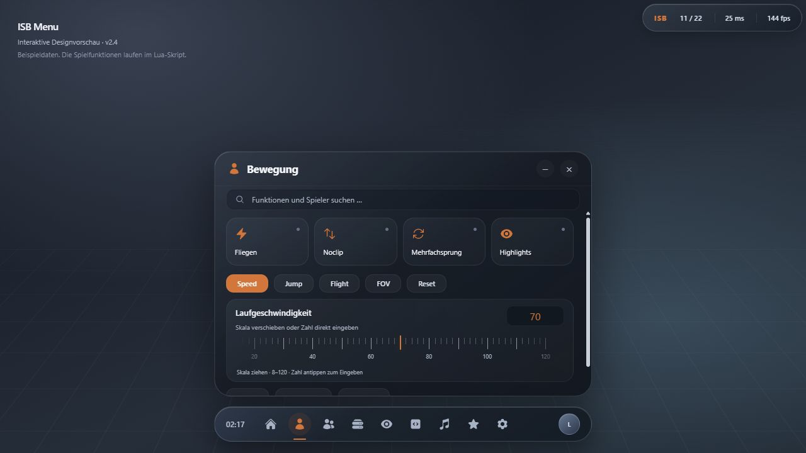
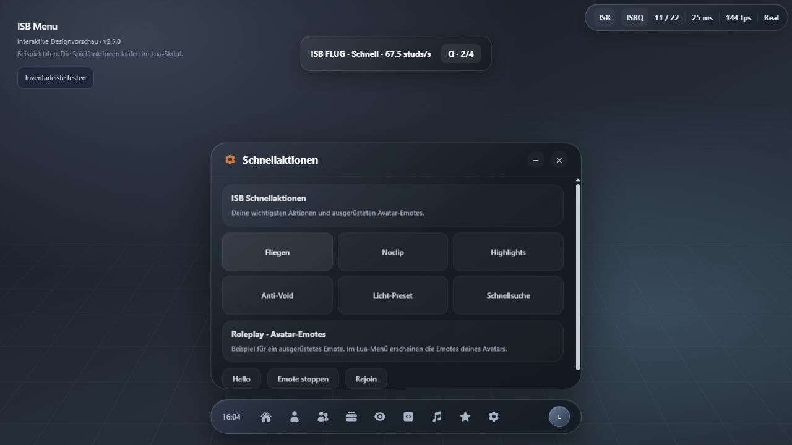

# ISB Menu 2.6.13 · by Larsiopuw

Glossy Dark: dunkles Graphit, durchscheinende Flächen, weiche Lichtkanten und ein einstellbarer Akzent. Feste Navigation unten mittig, Statusleiste sechs Pixel von der oberen rechten Spielkante entfernt.



Der Executor-Name steht jetzt zusätzlich ganz rechts in der Statusleiste. Lange Namen werden mit Auslassungspunkten gekürzt.

Benachrichtigungen stehen zwölf Pixel vom unteren rechten Bildschirmrand. Das Dock reserviert automatisch Platz über sichtbaren, erkennbaren Inventar-/Hotbar-Leisten. Nicht zugängliche oder unbekannt benannte Sonderinventare können nicht zuverlässig erkannt werden. Die Sitzungsdetails zeigen Spielname, Place-ID, Universe-ID, Serverart, Job-ID und Spiellink getrennt; Link und Server-ID sind kopierbar.

Neu in 2.4.3: Die Statusleiste wächst mit ihren Texten. Sitzungsdaten stehen in anklickbaren Kopierfeldern neben dem Roblox-Spielicon; der rohe Spiellink wird nicht zusätzlich angezeigt. Namensanzeigen nutzen kompakte Karten. FOV gibt es unter Bewegung mit eigenem Reset. Buchstabenkürzel und ihre Erfassung folgen dem Tastaturlayout (einschließlich deutschem Z/Y); bei fehlender Layout-API gilt QWERTZ als Ersatz. Freund- und Admin-Austritte werden gemeldet, erneute Admin-Prüfungen erzeugen keine doppelten Beitrittsmeldungen.

## Änderungen in 2.6.13

Die gemeinsame GlassEdge-Kontur folgt nun ebenfalls dem halben Pixel Randabstand der sichtbaren Fläche; die bisherige 2-px-Geometrie ließ unter der Statuskontur einen Streifen stehen. Das betrifft auch andere Glasflächen.

Favoritensterne sitzen mittig rechts neben dem Bedienelement: Toggle/Start bei y=29, Zahlfeld bei y=26. Kompakter 28-px-Knopf mit subtiler Hintergrundfläche und mittigem 16-px-Symbol. Die Favoritenfunktion bleibt unverändert.

## Änderungen in 2.6.12

Gemeinsame Konturen: sichtbare Flächen und Rahmen benutzen dieselbe Geometrie und Rundung. Ein 1-px-Rahmen liegt mit 0.5-px-Inset direkt an der bewegten Fläche. Das gilt auch für Freund-/Admin-Karten. Dock-Symbole bleiben im relativen Mittelpunkt des animierten Bereichs; die zweite unabhängige Icon-Vergrößerung entfällt.

Menügröße skaliert jetzt alle Bildschirm-Oberflächen: Workspace, Status, Quick-Roleplay, Fluganzeige, Schnellsuche und Benachrichtigungen. Neu erstellte Fenster übernehmen den Wert; vorhandene UIScale-Instanzen werden wiederverwendet. Kleine Bildschirme begrenzen die Größe weiterhin auf den verfügbaren Platz. Weltbezogene Namensanzeigen behalten ihre eigene Entfernungsskalierung.

1781 simulierte Prüfungen und Luau -O0/-O1/-O2 bestanden. Status/Roleplay bei 75 Prozent sowie Rahmengeometrie und Dock-Mittelpunkt geprüft. Optik in Roblox noch durch den Benutzer zu bestätigen.

## Änderungen in 2.6.11

Standardknöpfe: mittig ausgerichtete Beschriftung mit 11 px und optischer Höhenkorrektur. Reset-Symbol und Text behalten getrennte Bereiche.

Musik: Automatisch sitzt mit gleicher Größe und Gestaltung neben den Windows-Quellen. Die aktive automatische Auswahl erhält eine Akzenttönung. Der Zeitbalken interpoliert den laufenden Titel zwischen Statusabfragen. Beim Ziehen wird die Minuten-/Sekundenanzeige direkt aktualisiert. Nach Loslassen bleibt das Ziel sichtbar, bis Windows es bestätigt; alte Statusantworten setzen den Balken nicht zurück. Ein Titel-/Quellenwechsel oder abgelehnter Befehl verwirft den ausstehenden Seek.

1773 simulierte Interaktionsprüfungen und Luau -O0/-O1/-O2 bestanden, einschließlich Sekundenanzeige beim Drag, stabiler Position nach Release und verspäteter Seek-Bestätigung. Mehrfachsprung bleibt unverändert.

## Änderungen in 2.6.10

Standardknöpfe: Icon und Beschriftung haben getrennte Bereiche mit acht Pixeln Abstand. Gemeinsames UIPadding wurde entfernt, damit es das Icon nicht in den Text verschiebt. Beide Inhalte bleiben im animierten Button-Face.

Windows-Musikplayer: Abspielen/Pause aktualisiert die Beschriftung sofort beim Klick. Verspätete Statusantworten überschreiben den erwarteten Zustand für bis zu zwei Sekunden nicht; Bestätigung gleicht ihn ab. Abgelehnte Befehle nehmen den Vorschauzustand zurück. Nach dem Befehl wird sofort erneut nach dem Status gefragt.

Benutzer bestätigt: Mehrfachsprung funktioniert auch nach wiederholtem Outfitwechsel. Die bestätigte Sprungimplementierung aus 2.6.9 bleibt unverändert. 1764 simulierte Prüfungen und Luau -O0/-O1/-O2 bestanden; darunter Textwechsel vor der Windows-Anfrage, verspätete Statusantwort und Fehlerkorrektur.

## Änderungen in 2.6.9

Standardknöpfe sitzen neben dem Zahlenfeld im oberen Kartenbereich. Helligkeit, Lautstärke und Menügröße benötigen dadurch keine zusätzliche leere Zeile. Shader-Texte und Kommentare verwenden neutrale Namen.

Mehrfachsprung nutzt zusätzlich die direkte Leertasten-/Gamepad-Eingabe, weil der reguläre Sprung-Request in manchen Steuerungen in der Luft nicht erneut ankommt. Beide Eingabewege werden entprellt; die Physikkorrektur bleibt einmalig. Die Wirkung auf dem echten R15-Avatar ist noch zu bestätigen.

Spielerliste: zunächst vier Karten; weitere Karten werden nur beim Scrollen benötigt und höchstens zwei pro Bildschritt erstellt. Die vollständige Liste wird vorab sortiert und durchsucht, unabhängig von bereits gebauten Karten. Der Wechsel zu einem anderen Tab verwirft die ausstehende Erstellung. 75 Spieler, Suche nach dem letzten noch nicht gebauten Eintrag und Abbruch beim Tabwechsel wurden simuliert geprüft.

Musik: getrennte Meldung für eine beendete Windows-Bridge; automatische Wiederverbindung beim nächsten Poll. „Automatisch“ fordert unmittelbar einen neuen Status an. Die Bridge muss als Windows-Prozess laufen. Optional richtet ISBMediaBridge-Autostart.ps1 die automatische Anmeldung ein; -Remove entfernt nur die Autostart-Verknüpfung. Spotify und Opera wurden aktuell erkannt. Auf Lars' PC wurde der Autostart ausdrücklich gewünscht und eingerichtet.

1748 simulierte Interaktionsprüfungen, Luau -O0/-O1/-O2 und Preview-JavaScript bestanden. Kartenanordnung im Browser visuell geprüft. Der Roblox-Start der neuen Fassung ist noch nicht bestätigt.

## Änderungen in 2.6.8

Bewegung: Reset setzt nur den ausgewählten Regler zurück. Die vier Flugstufen bleiben GLIDE 55, NORMAL 110, FAST 140 und TURBO 250 studs/s; ein Stufenwechsel benötigt jetzt 48 Pixel Zugweg. Alle vier Stufen sind beschriftet. Mehrfachsprung stellt den Sprungimpuls einmal nach dem Physikschritt wieder her, auch bei R15 und JumpHeight-Steuerung, ohne dauerhaft nach oben zu drücken.

Helligkeit, Musiklautstärke und Menügröße haben denselben kompakten Standardknopf mit Reset-Symbol innerhalb der Karte. Menügröße wird ohne Neuaufbau der Ansicht zurückgesetzt.

Shader ersetzt das bisherige Licht-Preset durch das Shaderprofil „Basic Realistic Shaders“: Helligkeit 2.25, Uhrzeit 17.55, Belichtung 0.1, Sättigung 0.25, Kontrast 0.1, Bloom 0.3/10/0.8 sowie Sonnenstrahlen und dieselben sechs Skybox-Assets. Future-Beleuchtung wird angewendet, wenn die Roblox-API es erlaubt. Abschalten entfernt eigene Effekte und stellt die zuvor geänderten Lichtwerte wieder her. Kein externer Shader-Code wird zur Laufzeit geladen. Die tatsächliche Darstellung hängt vom Spiel, seinen vorhandenen Effekten und den Grafikeinstellungen ab.

Skript-Details zeigen die Anbieter-Verifizierung als dasselbe Schild-Badge wie die Ergebniskarten. Lange Titel erhalten Platz über den Metadaten; die Aktionsknöpfe stehen unter dem Badge.

Quelltext bleibt in einer begrenzten Karte mit Innenabstand. Lange Loader-Zeilen umbrechen; längere Vorschauen scrollen vertikal innerhalb der Karte. Die Anzeige bleibt auf 12000 Zeichen begrenzt, während Kopieren und Ausführen weiterhin den vollständigen unveränderten Quelltext verwenden. 1740 simulierte Prüfungen und Luau -O0/-O1/-O2 bestanden, einschließlich langer Quelltextzeilen und vollständigem Kopieren.

Benutzer bestätigt die Kopf-Pose sowie Hover und Verifiziert-Badge der Karten aus 2.6.7. Die unverändert verbleibende Verzögerung beim Mitspieler ist keine lokale Sitzanimationskorrektur; eine feste gemeinsame Verbindung benötigt Spielserver-Unterstützung.

## Änderungen in 2.6.7

Auf dem Kopf hält den Avatar jetzt aufrecht und übernimmt die horizontale Blickrichtung des Ziels. Der bisherige senkrechte Abwärtsblick drehte den ganzen Charakter auf den Bauch. Animationsasset und eingefrorene Pose bei Sekunde 2 bleiben erhalten. Die tatsächliche Sitzhöhe hängt vom Avatar ab und die Optik benötigt noch Bestätigung im Spiel.

Skriptkarten: Verifizierung als gestaltetes Badge mit Schildsymbol, Hintergrund und Kontur. Die Kennzeichnung stammt vom Anbieter. Bildbereich und Symbol halten drei Pixel Abstand zum Kartenrand. Der Hover-Rahmen überdeckt das Bild nicht mehr mit einer getönten Fläche; Karte, Bild und Inhalt bewegen sich gemeinsam.

Performance: Status-Textbreiten werden in einem begrenzten Cache gespeichert. Inventare außerhalb der relevanten Bildschirmfläche werden vor der Slot-Prüfung ausgeschlossen. Unveränderte Detailtexte und FOV-Werte werden nicht erneut geschrieben. 1722 simulierte Prüfungen und Luau -O0/-O1/-O2 bestanden. Die verbleibenden sporadischen Ruckler sind damit noch nicht als beseitigt bestätigt.

## Änderungen in 2.6.6

Performance: Inventarleisten werden zwischengespeichert. Vollständige GUI-Suchen erfolgen beim Start und nach relevanten Strukturänderungen, nicht mehr zweimal pro Sekunde. Unveränderte Inventarleisten prüfen nur die bekannten Elemente. Eigene Körperteile werden für Noclip/Roleplay einmal erfasst und bei hinzugefügten Teilen ergänzt. Detailwerte werden nur in der geöffneten Detailansicht aktualisiert; unveränderte Sprunghöhe und eingefrorene Animation werden nicht ständig neu geschrieben.

Auf dem Kopf: dieselbe Sitzanimation und Pose bei Sekunde 2; die senkrechte Blickrichtung erhält eine eindeutige horizontale Ausrichtung vom Ziel. So wird die mehrdeutige Rotation bei einem Blick exakt nach unten vermieden. Die Optik ist noch im Spiel zu bestätigen.

Der Benutzer bestätigt, dass auch Referenz aus Sicht des Mitspielers verzögert folgt. Lokale Render-Korrekturen erzeugen keine gemeinsame serverseitige Verbindung. Eine garantiert feste Verbindung für alle Clients benötigt Unterstützung des Spiels auf dem Server; das Menü stellt dafür keine Wirkung vor, die es nicht liefern kann. [Roblox-Netzwerkeigentum](https://create.roblox.com/docs/physics/network-ownership). Es wird kein fremder PhysicsRepRootPart zugewiesen.

1717 simulierte Prüfungen bestanden, einschließlich eines GUI-Baums mit 1000 unbeteiligten Elementen ohne wiederholte Vollsuche, wiederholtem Kollisionsabgleich ohne Charakter-Vollsuche und stabiler Kopf-Ausrichtung. Luau kompiliert auf -O0/-O1/-O2. Die tatsächliche Framezeit im Spiel und die Kopf-Pose sind noch live zu prüfen.

## Änderungen in 2.6.5

Kopierbuttons in Spieler-Details animieren Fläche, Kontur und Symbol gemeinsam; das Symbol wird nicht zusätzlich aufgeblasen. Wiederholtes Hover wird geprüft. Bewegung und Darstellung haben keine Suchleiste mehr. Die Serversuche filtert die geladene Seite nach Server-ID und Spielerzahl; die öffentliche Serverliste liefert keine Spielernamen oder privaten Einladungscodes. Favoriten durchsucht ausschließlich gespeicherte Funktionen. Skripte verwendet die gestalteten Filter Beliebt / Neu / Favoriten ohne frei stehendes Entdecken-Label.

FPS-Limits werden bei erkannten Überschreibungen erneut gesetzt und mit der gemessenen Bildrate verglichen. Wenn ein Executor den Wert ignoriert, erscheint eine konkrete Meldung statt einer unbestätigten Erfolgsmeldung. Das vorherige Limit wird wiederhergestellt, sofern es auslesbar ist. Die tatsächliche Begrenzung im betroffenen Client muss noch bestätigt werden.

Roleplay gleicht die Zielposition zusätzlich nach der Simulation ab. Die lokale Darstellung folgt der gerenderten Zielpose ohne zusätzliche Glättung. Die Verzögerung aus Sicht eines anderen Spielers benötigt weiterhin einen gemeinsamen Live-Test; Netzwerkverzögerung kann allein lokal nicht verlässlich beseitigt werden.

1724 simulierte Interaktions-/Lifecycle-Prüfungen und Luau-Kompilierung auf -O0/-O1/-O2 bestanden. Potassium-Kompatibilität von 2.6.4 wurde vom Benutzer bestätigt.

## Änderungen in 2.6.4

Executor-Kompatibilität: Die Begrüßung wird in einer eigenen Funktion aufgebaut. Der unoptimierte Luau-Compiler überschritt in 2.6.3 beim Aufbau der Begrüßung die Grenze von 200 lokalen Registern; Optimierungsstufe 1 und 2 waren nicht betroffen. 2.6.4 kompiliert nun auf allen drei Stufen (-O0, -O1 und -O2). 1707 simulierte Interaktions-/Lifecycle-Prüfungen bestehen weiterhin.

Der Benutzer hat bestätigt, dass 2.6.4 auf Potassium wieder funktioniert; sein eigener Executor funktionierte zuvor bereits. [Diagnose-Loader](ISBMenu-Executor-Diagnose.lua) trennt Download, Kompilierung und Menüstart und zeigt den ursprünglichen Fehler. Die Optik und Animation der Begrüßung bleiben erhalten.

## Änderungen in 2.6.3

Die vier Flugstufen übernehmen die festen Geschwindigkeiten und Namen der Flugreferenz: GLIDE 55, NORMAL 110, FAST 140 und TURBO 250 studs/s. Q und der Knopf in der Flugleiste schalten die Stufen zyklisch. Der Flight-Regler wählt nun die Stufe 1–4; ein alter gespeicherter Basiswert verändert die Originalgeschwindigkeiten nicht mehr. Reset setzt Stufe 1. Flugleiste und Animationen verwenden dieselbe Stufentabelle, einschließlich der Originalfarben. Die bestehende ISB-Flugphysik mit weicher Beschleunigung bleibt erhalten.

Luau kompiliert; 1707 simulierte Prüfungen bestanden. Alle vier Zielgeschwindigkeiten wurden mit Bewegungseingabe geprüft. Die sichtbare Wirkung im konkreten Spiel benötigt weiterhin einen Live-Test.

## Änderungen in 2.6.2

Die Flugleiste bietet Fly, Mysterious, Villain Fly, Superman und Halloween Fly aus der Flugreferenz. Der Standardstyle heißt Fly; der Dropdown-Pfeil wird aus Formen gezeichnet. Frühere gespeicherte TLFly-Auswahlen werden übernommen. Die Auswahl bleibt gespeichert und kann während des Fluges geändert werden. Stufe 1 verwendet die Gleitpose, Stufe 2 die ruhige Flugpose; Stufen 3/4 wechseln abhängig von der tatsächlich erreichten Geschwindigkeit zur Vorwärtspose. Stufe 4 verwendet bei Styles mit zusätzlichem Clip die schnelle Alternativpose. Übergänge blenden weich über. Q und die bisherigen vier Geschwindigkeitsfaktoren bleiben erhalten.

Das Dropdown sitzt außerhalb der geklippten Flugleiste. Auf schmalen Bildschirmen stehen die Bedienelemente in einer zweiten Zeile. Beim Landen, Style-Wechsel, Respawn und Entfernen des Menüs werden eigene Flugtracks freigegeben; überholte Ladeaufträge werden verworfen. Verfügbarkeit und sichtbare Wirkung der Sitzanimationsassets im jeweiligen Spiel benötigen einen Live-Test.

Luau kompiliert; 1705 simulierte Prüfungen bestanden, einschließlich Style-Auswahl/Speicherung, maximaler Superman-Pose, Rückwechsel beim Abbremsen, schmaler Flugleiste und Track-Bereinigung.

## Änderungen in 2.6.1

Button-Konturen liegen innerhalb der bewegten Fläche mit zwei Pixeln Abstand. Scrollinhalte haben Sicherheitsabstände oben und links. Freund- und Admin-Flächen sowie ihre Konturen übernehmen denselben Radius und Abstand wie die Karten; doppelte Standardflächen entfallen. Die Renderflächen der gestaffelten Begrüßung reservieren Platz für Hover-Vergrößerung und Anhebung.

Luau kompiliert; 1362 simulierte Lifecycle-/Interaktionsprüfungen bestanden, einschließlich Hover-Grenzen während der Begrüßung, innerer Konturen und gemeinsamer Radien von Beziehungskarten. Die optische Prüfung im Spiel bleibt gesondert zu bestätigen.

## Änderungen in 2.6.0

Freunde erhalten blaue, Spiel-Admins rote Karten samt Kennzeichnung. Bei blauem Akzent erscheinen normale ESP-Markierungen goldgelb; Freunde bleiben blau und Admins rot. Roleplay folgt dem Ziel direkt nach der Charakteraktualisierung ohne die bisherige Lerp-Verzögerung. Zielgeschwindigkeit wird übernommen; die bereits bestätigte Avatar-Sichtbarkeit bleibt erhalten. Das Verhalten bei bewegten Zielen benötigt weiterhin einen Test mit einem anderen Spieler.

Timer und Stoppuhr sind vollständig entfernt. Der Musik-Tab enthält einen Windows-Player für Spotify und Browser-Medien sowie zusätzlich Roblox-Audio. [ISBMediaBridge.exe](ISBMediaBridge.exe) muss dafür im Hintergrund laufen; [Anleitung](ISBMediaBridge-README.md). Titel, Künstler, Coverbild, Position und Quellen werden automatisch erkannt. Cover werden aus der Windows-Mediensitzung gelesen und beim Titelwechsel zwischengespeichert. Befehle hängen von den Funktionen des jeweiligen Players ab. Lautstärke betrifft die gesamte ausgewählte App, bei YouTube den Browser. Die App muss dafür eine Windows-Audiositzung bereitstellen.

Tabs wechseln ohne künstliches Ausblenden. Neu aufgebaute Karten blenden nicht jedes Mal ein. Gesundheits-, Team- und Rollenwerte ändern sich in bestehenden Spieler-Details; Listen-Aktualisierungen werden gesammelt. Reset-Regler aktualisieren vorhandene Controls. Helligkeit hat einen Reset auf den tatsächlichen Spielwert vor der ersten Änderung. Musiklautstärke kehrt auf 35 Prozent zurück. Die App-Lautstärke wird lokal sofort dargestellt, Windows erhält während des Ziehens neue Werte mit maximal etwa 12 Aktualisierungen pro Sekunde und beim Loslassen den Abschlusswert; verspätete Rückmeldungen setzen den Regler nicht zurück. Beide Lautstärke-Skalen unterstützen feinere Ziehschritte.

Klick-, Hover-, Hinweis-, Beitritts- und Austrittssounds sind lauter; neue Cache-Dateien verhindern die Verwendung der alten leisen WAVs. Der redundante Minimieren-Knopf wurde entfernt. X schließt die Ansicht, K Ansicht und Toolbar zusammen; M funktioniert nur mit sichtbarer Toolbar.

Luau und Preview-JavaScript geprüft; 1268 simulierte Interaktions-/Lifecycle-Assertions bestanden. Die gebaute Windows-EXE wurde gestartet, Spotify und Opera wurden erkannt, ein Positionsbefehl für Spotify wurde angenommen. Unauthentifizierte Anfragen und Browser-Origin-Anfragen werden mit 403 abgewiesen. Die Testfassung wurde in Roblox geladen; der Benutzer bestätigte die Medienanzeige und den Helligkeits-Reset. Auch die flüssige Lautstärke-Regelung und die entfernte Minus-Schaltfläche wurden vom Benutzer im Spiel bestätigt. Die direkte Roleplay-Zielbindung ist implementiert und simuliert geprüft; ein Test mit bewegtem Ziel und anderem Spieler steht noch aus.

Die Begrüßung verwendet dieselbe Glasfläche wie das Dock, zeigt „Hey <Anzeigename>“ rund 2,8 Sekunden und blendet danach Uhr, Navigationsicons und zuletzt das Profil gestaffelt ein. Nach insgesamt rund 4,8 Sekunden erscheint die Startansicht. Reduzierte Bewegung überspringt die Sequenz; K kann sie abbrechen. Coverbild, Begrüßungsreihenfolge und laufende Lautstärkeübertragung während des Ziehens wurden vom Benutzer im Spiel bestätigt.

Gemeinsame Karten, Sitzungs- und Profilflächen verwenden abgestufte Flächenfarben, feine Konturen und weichere Rundungen entsprechend der Designvorschau. Schaltflächen haben dezente Konturen. Helligkeits- und Musik-Reset stehen in einer eigenen Zeile unter der Reglerkarte. Lange Zahlen werden mit höchstens zwei Nachkommastellen angezeigt; der Helligkeits-Reset behält den exakten ursprünglichen Spielwert. Die abschließende Flächen-Anpassung wurde ohne Scriptfehler in Roblox geladen und simuliert geprüft; ihre visuelle Live-Prüfung wurde durch den Benutzer beendet und steht noch aus.

Die folgenden Abschnitte dokumentieren frühere Versionen.

## Änderungen in 2.5.8

Die obere Aktivitätskapsel wurde nach dem Live-Test auf Benutzerwunsch vollständig entfernt. Musik, Timer und Stoppuhr liegen im normalen Musikmenü. Beide Uhren laufen unabhängig weiter; jede hat Pause/Weiter und Zurücksetzen. Helligkeit lässt sich in Darstellung einstellen. Die Begrüßung „Hey, <Anzeigename>.“ blendet am Dock ein und geht danach in die Navigation über; reduzierte Bewegung wird berücksichtigt.

Gezeichnete Kopier-Icons vergrößern sich deutlich um 32 Prozent innerhalb der gemeinsamen bewegten Fläche. Dezente Hover- und Benachrichtigungstöne sind gebündelt, gedrosselt und über Interface-Sounds abschaltbar. Freund-/Admin-Beitritt und Verlassen haben eigene Töne.

Speed und Jump werden zusätzlich bei Eigenschaftsänderungen sowie in Heartbeat und RenderStepped erneut angewendet. Eigene Verbindungen werden beim Wechsel des Humanoids und beim Entfernen des Menüs getrennt. Roleplay verknüpft den eigenen PhysicsRepRootPart nicht mehr mit einem fremden Avatar. Wirkung gegen die konkreten Spiel-Resets und Sichtbarkeit auf einem anderen Client sind noch nicht durch den Benutzer bestätigt.

Die fest codierte Regionsmeldung wurde ersetzt: vom Spiel gemeldete Serverregion hat Vorrang, andernfalls wird ein verfügbarer öffentlicher Verbindungsendpunkt gezielt per HTTPS geolokalisiert und als „Verbindung“ bezeichnet. Es wird niemals ersatzweise die Spieler-IP abgefragt. Im aktuellen Live-Client liefert die zugängliche LogHistory keinen Serverendpunkt; dort bleibt die ehrliche Meldung „Server meldet keine Region“. Roblox-Netzwerkvermittlung erlaubt keine garantierte Aussage über die physische Serverregion.

1185 simulierte Assertions bestehen; sie prüfen insbesondere Kopieren, Bewegung nach Spiel-Overrides, getrennte Uhren und das vollständige Entfernen der oberen Kapsel. Der Live-Loader meldet erfolgreichen Start; die abschließende Benutzerbestätigung für Kopier-Hover, Speed und fremde Avataransicht steht aus.

## Korrekturen in 2.5.6

Alle Buttons verwenden eine gemeinsame bewegte Ebene für Fläche und Inhalt, einschließlich kleinen Fensterbuttons, Kategorien, Bewegungskacheln und Schaltern. Das Dock behält seine angehobene Hoverbewegung. In den Panels bewegt sich die vollständige Fläche innerhalb ihrer festen Eingabegrenzen; Icons erhalten zusätzlich eine zentrierte Vergrößerung. Rahmen liegen einen Pixel innen und folgen derselben Ebene. Verschachtelte Skriptbilder erhalten keine eigene Vergrößerung. Favoritensterne sind im inaktiven Zustand heller.

Namenskarten sind fest 156 × 44 Pixel groß: Name 14 Pixel, Entfernung 12 Pixel. Sie schrumpfen nicht mehr mit der Weltentfernung. Die Musiklautstärke hat im selben Einstellungsbereich einen Reset auf den bisherigen Standard von 35 Prozent; Wert, Skala und gespeicherte Einstellung werden aktualisiert. Die Designvorschau enthält den gleichen Reset.

1264 simulierte Assertions bestehen, einschließlich Randgeometrie für kleine und breite Buttons, Hover-Rücksetzung, Start-Hover vor fertigem Layout, Lautstärke-Reset und dauerhaft lesbarer Namensschrift. Luau und Preview-JavaScript sind geprüft. Die Testfassung wurde in Roblox mit Real 2.7.5 geladen. Eine Engine-Aufnahme erfasste 32 Button-Flächen mit innenliegendem Rahmen, darunter eine aktive Hover-Fläche innerhalb ihrer Eingabegrenzen, sowie 27 Namenskarten mit 14-Pixel-Schrift. Das bestätigt diese Aufnahme und ersetzt keine Prüfung jedes Controls in allen Spielen.

## Korrekturen in 2.5.5

Hover gehört nur einem Bedienelement gleichzeitig und endet beim Verlassen, Fokusverlust oder Schließen. Kleine Buttons und Schalter behalten ihre vollständige Form; Rahmen und Fläche haben dieselbe Geometrie. Die Animation bewegt nur direkte Icons und keine verschachtelten Vorschaubilder. Skriptbilder bleiben im Bildbereich; Favoriten-Icons erhalten die Ebene ihres Buttons. Mikrofonbild und Hinweis sind zentriert.

K schließt Dock und Fenster gemeinsam. M öffnet das Fenster nur bei sichtbarem Dock; auch verzögerte Tabwechsel können kein einzelnes Fenster mehr öffnen. Sichtbare leere native Werkzeugleisten reservieren keinen Abstand. Bei unbekannten eigenen Inventaren bleibt die Erkennung von sichtbaren Inhalten abhängig.

Roleplay löst verpackte Animationsassets vor dem Laden auf, verwendet Action4 und hält die Kopf-Sitzpose nach zwei Sekunden fest. Huckepack folgt der Referenz-Ausrichtung; ohne Auswahl wird der nächste verfügbare Spieler gewählt. Schulter- und Trageanimationen laufen weiter, statt versehentlich die Kopf-Pose zu übernehmen.

946 simulierte Assertions und Luau-Kompilierung bestehen. Roblox war bei dieser Prüfung geschlossen; Layout, Mikrofonbedienung und Roleplay-Physik dieser Fassung wurden noch nicht erneut im Spiel bestätigt. Die folgenden Abschnitte dokumentieren ältere Versionen.

## Live-Prüfung und Korrekturen in 2.5.4

Das Menü wurde in Roblox mit Real 2.7.4 geöffnet und die Navigation samt Eingabeereignissen geprüft. Die Browser-Vorschau verwendete stärkere Bewegungen als die Spieloberfläche. Icons skalieren jetzt um ihre Mitte; Dock-Hover hebt sie vier Pixel an, andere Button-Icons zwei Pixel. Die vollständige Button-Fläche samt Beschriftung liegt in einer eigenen animierten visuellen Ebene: zwei Pixel Lift, bis zu 1,035-fache Hover-Skalierung und 0,96-fache Druck-Skalierung. Rahmen und Fläche skalieren gemeinsam; ein Sicherheitsrand und begrenzte Expansion verhindern das Abschneiden an umgebenden Karten. Die Hervorhebung ist stärker, die klickbare Fläche bleibt unverändert. Dunkle Glasflächen lassen nur noch 2,5 Prozent des Hintergrundes durch.

Beim Beenden des Voice-Modus wird die letzte gewählte Stummschaltung nach Wiederherstellen der Core-Verbindungen erneut angewendet, soweit die Voice-API zugänglich ist.

938 simulierte Assertions und Luau-Kompilierung bestehen. Der Live-Test bestätigt Tabwechsel und sichtbare Hover-Zustände, Der Benutzer bestätigt angehobene Dock-Icons, funktionierende Hoveranimation auf den übrigen Schaltflächen und verschwundenes Mausflackern; dies ist kein allgemeiner Nachweis für alle Spiele/Executors. Farbwerte in der PC-Aufnahme weichen selbst bei einfachen Testflächen von den gesetzten RGB-Werten ab; die Ursache dieser Aufnahme-/Darstellungsabweichung ist noch offen. Die Palette wird daher nicht blind auf diese Messung angepasst. Browser und Roblox verwenden unterschiedliche Renderer und Schriftmetriken.

## Korrekturen in 2.5.3

Das Mikrofon liegt in einer eigenen ScreenGui, bevorzugt im geschützten UI-/CoreGui-Bereich und ersatzweise im PlayerGui. Es erscheint bereits vor dem Voice-Reconnect, bleibt bei geschlossenem Hauptfenster sichtbar und wird bei versehentlicher Entfernung während des aktiven Modus wieder aufgebaut. Kein automatisches Freigeben des Mikrofons beim Start.

Alle Schaltflächen verwenden gemeinsame Hover-/Druckanimationen für Hervorhebung, Text und Icons. Die klickbare Fläche bleibt still; das Menü zeichnet keinen zusätzlichen Cursor und ändert kein Maus-Icon. Die Option „Weniger Animationen“ deaktiviert die Bewegungen. Desktop-Buttons erhalten keinen automatischen Gamepad-Auswahlfokus.

Ping: bis 100 ms grün, 101–200 ms gelb, darüber rot. FPS: ab 55 grün, 30–54 gelb, unter 30 rot. Unbekannte Werte bleiben neutral.

## Korrekturen in 2.5.2

Der aktive Voice-Modus besitzt oben links ein eigenes Mikrofon zum Stummschalten und Freigeben. Er übernimmt beim Start den vorhandenen Mute-Zustand und verwendet dieselbe Steuerung wie der Voice-Tab.

ISBQ enthält eine kompakte Spielerauswahl mit Avatar, Suche und Entfernung. Ohne feste Auswahl wird bei jedem Start der nächste lebende, verfügbare Spieler gewählt. „Automatisch · Nächster Spieler“ entfernt eine feste Auswahl. Kopf-/Huckepack-Aktionen übernehmen Position, Ausrichtung, gedämpftes Nachführen und Sitz-Zustandssteuerung aus der Referenz. Die optionale Physik-Verknüpfung wird bei zugänglicher Lese-/Schreib-API gesetzt und beim Stoppen wiederhergestellt. Namenskarten werden mit zunehmender Entfernung kleiner (bis 40 %).

Die Browser-Vorschau zeigt Beispieldaten und führt keine Roblox-Aktionen aus. Mikrofon-/Roleplay-Funktionen wurden mit der simulierten API geprüft. Ein vollständiger Live-Test von Mute/Unmute und Roleplay-Physik ist weiterhin offen.

## Korrekturen in 2.5.1

Kopierfelder verwenden gezeichnete Kopier-Icons statt eines nicht unterstützten Zeichens. Die Namenskarten zeigen das Avatarbild des jeweiligen Spielers. Beobachten wird am gleichen Knopf mit „Beenden“ ausgeschaltet; beim Verlassen wird die Kamera weiterhin wiederhergestellt. Die Skalierung liegt in einer abgerundeten Karte und hat „Standard · 100 %“ als Reset.

Rollenerkennung berücksichtigt neben Owner/Admin/Developer/Moderator auch CoOwner, Co-Owner, Manager/Management, Helper, Supporter und Support-Team. Teamzuweisung ist dafür nicht notwendig. Fan-/Not-/Former-/Ex-Bezeichnungen werden ausgeschlossen. Öffentliche Gruppenrollen sind Hinweise auf Staff, kein Beweis für tatsächliche Spielberechtigungen.

Outfits werden auf selbst gespeicherte vollständige Avatare gefiltert; gekaufte Pakete, Animationen und Köpfe werden nicht als gespeicherte Charaktere angezeigt. Der Abruf wurde anonym beim Benutzer aus dem Screenshot mit HTTP 200 und neun passenden Einträgen geprüft. Filter: [Roblox Avatar API](https://create.roblox.com/docs/cloud/reference/domains/avatar).

Der lokale Voice-Start verlässt Voice, wartet 2,3 Sekunden, fordert den Join an und wendet nach weiteren 0,3 Sekunden die Verbindungssteuerung an; die achte Verbindung wird aktiviert und ausgelöst. Abbruch verhindert verspätete Join-/Ready-Aufrufe. Ausschalten und Beenden stellen die erfassten Verbindungszustände wieder her. Kein Nachweis eines Schutzes vor serverseitigen Voice-Sperren.

## Funktionen ab 2.5

- Lesbarere Schrift, stärkere Statuswerte und kompakte ISB-/ISBQ-Schaltflächen. ISB schaltet das Dock; ISBQ öffnet ein eigenes Roleplay-Panel direkt unter der oberen Statusleiste, mit passender Breite und unabhängig vom Hauptfenster.
- Spielersuche durchsucht ausschließlich Spieler. Freunde stehen vor erkanntem Staff, danach folgen die übrigen Spieler; Aktualisierungen erhalten die Scrollposition. Die genaue öffentliche Gruppenrolle erscheint in der Liste.
- Details: Avatar, Benutzer-ID, Accountalter, Team, Gesundheit, Beziehung, Gruppenrolle und Profil-Link. „Freund anfragen“ öffnet den Roblox-Dialog. Namenshistorie (erste zehn Einträge) und gespeicherte Avatar-Outfits (erste zwanzig; isEditable=true und outfitType=Avatar) werden erst auf Klick geladen und zwischengespeichert. Fehler und leere Ergebnisse werden ausgewiesen.
- Speed und Jump werden bei aktivierter Funktion vor jedem Physikschritt lokal erneut angewendet. Getrennte Werte; JumpPower/JumpHeight werden unterstützt. Mehrfachsprung setzt zusätzlich einen Aufwärtsimpuls. Serverkorrekturen können weiterhin eingreifen.
- Q schaltet beim Fliegen vier Stufen: Normal 1×, Schnell 1,5×, Turbo 2× und Maximum 3× des eingestellten Flugtempos. Eine kompakte Anzeige zeigt Tempo und Stufe; deren Taste ist ebenfalls umbelegbar. Beim Schreiben greifen die Kürzel nicht.
- Anti-Void merkt sich bei Bodenkontakt die letzte sichere Position und korrigiert lokal vor Erreichen der Fallgrenze. Keine Garantie gegen serverseitigen Tod oder spezielle Spielmechaniken.
- Licht-Preset mit dezenter Farbkorrektur und Bloom; entfernt beim Ausschalten nur die selbst erzeugten Effekte.
- Einstellungen für Links/Mitte/Rechts, Größe 50–120 %, Benachrichtigungen, Sounds und Öffnen beim Start werden automatisch gespeichert, sofern der Executor Dateizugriff bietet. Auf kleinen Bildschirmen wird die Größe zusätzlich begrenzt.

Roleplay enthält Auf dem Kopf, Huckepack, Huckepack 2, Schulter sitzen, Umarmen und Tragen. Zielspieler auswählen oder den nächsten Spieler automatisch wählen lassen und Aktion starten; Stoppen stellt eigene Charakterwerte und Kollisionen wieder her. Es wird ausschließlich der eigene Charakter lokal an einer relativen Position des Zielspielers gehalten. Die Aktionen verändern keinen fremden Charakter. Replikation, Animationen und Serverkorrekturen hängen vom Spiel und den Asset-Berechtigungen ab. Die Vorschau ist eine Browserdarstellung mit ausdrücklich markierten Beispieldaten.



## Starten

```lua
loadstring(game:HttpGet("https://raw.githubusercontent.com/Larsiopuw/ISB-Menu/main/ISBMenu.lua"))()
-- by Larsiopuw
```

Öffentlicher, lesbarer Quellcode. Der Loader lädt den aktuellen Stand von main. Alternativ ISBMenu.lua vollständig ausführen. Der lokale Loader lädt die Datei; der GitHub-Loader enthält Fehlerprüfung.

| Taste | Funktion |
| --- | --- |
| M | Hauptpanel öffnen / schließen |
| K | Festes Dock einfahren / ausfahren |
| T | Mittige Skript-Schnellsuche |
| F | Fliegen an / aus |
| Z | Noclip an / aus |
| E | Highlights / ESP an / aus |
| V | Konfigurierte Laufgeschwindigkeit an / aus |
| Q | Während des Fliegens nächste Geschwindigkeitsstufe |
| Escape | Schnellsuche oder Tastenaufnahme abbrechen |

Tasten in Einstellungen anklicken und neu belegen. Doppelte Belegungen werden abgewiesen; beim Schreiben greifen die Kürzel nicht. Fenster und Dock bleiben an der in Allgemein gewählten Position verankert. Erneutes Ausführen ersetzt die vorherige Instanz.

## Änderungen in 2.4

- Neue Rollskala für Speed, Jump, Flight, FOV und Musiklautstärke. Teilstriche und Zahlen bewegen sich unter einer festen Mittelmarkierung; kein verschiebbarer Punkt und keine Fülllinie. Nach links ziehen erhöht den Wert, nach rechts verringert ihn. Der gesamte sichtbare Skalenbereich ist der Griff. Während des Ziehens pausiert das Scrollen des Panels.
- Die Zahl ist ein editierbares Feld. Eingaben oberhalb des voreingestellten Skalenbereichs sind möglich; Komma und Dezimalpunkt werden akzeptiert. Beim nächsten Ziehen kehrt der Regler in den voreingestellten Bereich zurück.
- Manuelle Bereiche: Speed/Jump/Flight 0–10.000, FOV 1–120 Grad, Lautstärke 0–1.000 Prozent. Ungültige oder nicht endliche Eingaben werden abgewiesen. Skala: Speed 8–120, Jump 20–150, Flight 5–150, FOV 40–110, Lautstärke 0–100.
- Flugbewegung mit kontinuierlicher, kritisch gedämpfter Beschleunigung und Bremsung vor dem Physikschritt. Gleiche Zielgeschwindigkeit bei unterschiedlichen Physikraten; weichere Übergänge und höhere Orientierungsresponsivität.
- Lauf-/Schrittgeräusche des eigenen Charakters werden während des Fluges gezielt stummgeschaltet; ursprüngliche Lautstärken werden beim Ausschalten, Respawn und Beenden wiederhergestellt. Auch neu angelegte Schrittgeräusche werden berücksichtigt. Andere Musik bleibt unverändert.
- F/Z/E/V schalten die Funktionen um. Alle sieben Belegungen sind in Einstellungen → Tasten änderbar und werden gespeichert. Doppelte Belegungen werden abgewiesen; Textfelder und bereits verarbeitete Eingaben lösen keine Aktionen aus.
- Ersatzzeiger aus 2.3.1 vollständig entfernt. Das Menü zeichnet keinen eigenen Mauszeiger und ändert weder MouseIcon noch MouseIconEnabled. Interaktive Text-/Bildflächen ersetzen native GuiButtons, um deren Handzeiger-Wechsel zu umgehen. Klick, Touch, Hover und Tastaturauswahl bleiben bedienbar; Fokusverlust verwirft einen begonnenen Klick.

Das gemeldete Mausflackern ist ohne Live-Client nicht reproduziert. Die überarbeitete Eingabesteuerung ist geprüft; eine vollständige Behebung auf dem betroffenen PC ist noch nicht bestätigt. Spiel- oder Executor-eigene Mausgrafiken werden nicht verändert.

## Änderungen in 2.3

- Glossy Dark mit Lichtverläufen und enthaltenen Rahmen; Akzent einstellbar.
- Hinweiskarten erscheinen nur bei geschlossenem Panel und geschlossener Schnellsuche. Bei offenen Panels reagiert nur das Dock-Symbol auf Hover.
- Statusleiste ignoriert den Roblox-GUI-Abstand und sitzt direkt oben rechts.
- Profil mit Avatar, Rolle, Kontoalter, UserId, Sammlung, Executor, Version, Place/Universe, Sitzung und Speicherstatus.
- Profilwerkzeuge zum Kopieren von Sitzungsdaten und Exportieren der Einstellungen. Owner/Admin erhalten lokale Diagnose-, Benachrichtigungs- und Erkennungswerkzeuge.
- Automatisches Speichern von Einstellungen, Tasten, Reglerwerten, Lautstärke, Erkennung, Performance, Anbieter und Favoriten.
- Skripte laden direkt beim Öffnen: Beliebt, Neu oder Favoriten. Karten mit Titel, Spiel, Aufrufen und Vorschaubild, soweit verfügbar.
- Overhead-Anbindung und zugehöriges Server-Skript entfernt.

## Funktionen

| Bereich | Enthalten |
| --- | --- |
| Start | Spiel, Spieler/Freunde, Executor, Sitzungsdauer und Rolle |
| Bewegung | Weicher kamerabezogener Flug, Noclip, Mehrfachsprung, Speed/Jump/Flight/FOV, Reset, Respawn, Rejoin, Serverhop |
| Spieler | Suche, Avatare, Beobachten, Kamerarückkehr, lokale Positionsänderung |
| Server | Öffentliche Server, Sortierung, Cursor-Seiten, Beitreten, Join-Script kopieren |
| Darstellung | Highlights, Namen/Entfernung, Tageslicht, Schatten, FOV |
| Skripte | ScriptBlox/RoScripts, Entdecken, Suche, gespeicherte Skripte, Quelltextvorschau, Kopieren, ausdrückliches Ausführen, lokale Lua-Dateien |
| Musik | Roblox-Audio-IDs, Warteschlange, Lautstärke, Pause, Timer, Stoppuhr |
| Einstellungen | Akzent, Klänge, Tasten, Performance, Erkennung, Protokoll |
| Profil | Konto-/Sitzungsdaten, Speicherstatus, Export, lokale Verwaltungswerkzeuge |

Flug: WASD, Space hoch, linke Strg runter; Touch mit Bewegungssteuerung und Höhentasten. Reset aktualisiert Spielwerte und sichtbare Regler. Freunde werden blau, öffentlich erkennbare Spiel-Admins rot markiert.

## Speicherung und Rollen

Einstellungen werden automatisch in ISBMenu-settings.json im Dateibereich des Executors gespeichert. Dafür sind readfile/writefile nötig; fehlender Dateizugriff erscheint im Profil. Skript-Favoriten speichern Metadaten, keinen fremden Quelltext. Aktive Bewegungsmodi werden beim Neustart nicht automatisch eingeschaltet.

OwnerNames enthält Larsiopuw; zusätzliche Menü-Admins stehen als numerische UserIds in CONFIG.AdminUserIds. Die Rolle steuert lokale Menüwerkzeuge und vergibt keine serverseitigen Spielrechte. Erkannte Gruppen-Admins sind davon getrennt.

## Prüfung und Grenzen

767 Assertions bestehen mit einer simulierten Roblox-API. Menü und beide Loader kompilieren mit Luau. Flugverlauf bei 30/120 Physikschritten, Geräusch-Wiederherstellung, Rollskala, direkte Zahleneingabe, alle vier Aktionskürzel und deren Speicherung wurden simuliert geprüft. Die HTML-Vorschau wurde im Browser bedient und visuell geprüft; sie zeigt Beispieldaten. **Kein Live-Test in Roblox/Executor durchgeführt.** Bewegung, Voice, Assets und Teleports hängen vom Spiel und Executor ab.

ScriptBlox nutzt die öffentliche API: Beliebt nach Aufrufen, Neu nach Aktualisierung. RoScripts nutzt öffentliche Trending-/Neu-Seiten und Such-HTML. Kein API-Key. Bei der Anbieterprüfung zu v2.3 lieferte ScriptBlox HTTP 200; der direkte RoScripts-Abruf wurde hier mit HTTP 403 blockiert. Anbieterfehler werden angezeigt; Website-Änderungen können Anpassungen erfordern. Fremder Code läuft erst nach ausdrücklichem Klick.

Vorschaubilder benötigen Dateizugriff und getcustomasset/getsynasset; PNG/JPEG werden unterstützt. Andernfalls bleibt eine gestaltete Ersatzfläche. Audio benötigt passende Asset-Freigaben. Heroicons unter beiliegender MIT-Lizenz; Interface-Klänge selbst synthetisiert.

Der experimentelle lokale Voice-Modus bietet keinen nachgewiesenen Schutz vor serverseitigen Voice-Sperren. Gruppenrollen werden anhand öffentlicher Bezeichnungen eingeordnet; versteckte oder anders benannte Rollen können fehlen. CONFIG.StaffUserIds ergänzt die Erkennung.

Erweiterungen: ISBMenu.AddAction, ISBMenu.Notify und ISBMenu.Destroy.

Designreferenz: [Apple Liquid Glass](https://developer.apple.com/videos/play/wwdc2025/219/). Anbieter: [ScriptBlox](https://docs.scriptblox.com/docs/scripts/fetch), [RoScripts Trending](https://roscripts.io/trending).

<!-- -- by Larsiopuw -->
