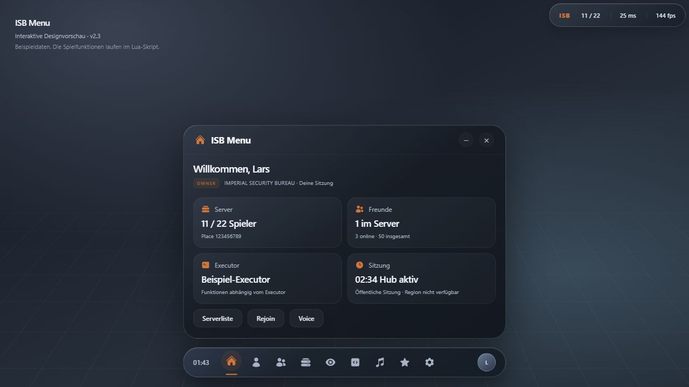

# ISB Menu 2.3 · by Larsiopuw

Glossy Dark: dunkles Graphit, durchscheinende Flächen, weiche Lichtkanten und ein einstellbarer Akzent. Feste Navigation unten mittig, Statusleiste sechs Pixel von der oberen rechten Spielkante entfernt.



## Starten

```lua
loadstring(game:HttpGet("https://raw.githubusercontent.com/Larsiopuw/ISB-Menu/main/ISBMenu.lua"))()
-- by Larsiopuw
```

Öffentlicher, lesbarer Quellcode. Der Loader lädt den aktuellen Stand von main. Alternativ ISBMenu.lua vollständig ausführen. Der lokale Loader lädt die Datei; der GitHub-Loader enthält Fehlerprüfung.

| Taste | Funktion |
| --- | --- |
| M | Hauptpanel öffnen / schließen |
| K | Festes Dock einfahren / ausfahren |
| T | Mittige Skript-Schnellsuche |
| Escape | Schnellsuche oder Tastenaufnahme abbrechen |

Tasten in Einstellungen anklicken und neu belegen. Doppelte Belegungen werden abgewiesen; beim Schreiben greifen die Kürzel nicht. Fenster und Dock bleiben fest positioniert. Erneutes Ausführen ersetzt die vorherige Instanz.

## Änderungen in 2.3

- Glossy Dark mit Lichtverläufen und enthaltenen Rahmen; Akzent einstellbar.
- Hinweiskarten erscheinen nur bei geschlossenem Panel und geschlossener Schnellsuche. Bei offenen Panels reagiert nur das Dock-Symbol auf Hover.
- Statusleiste ignoriert den Roblox-GUI-Abstand und sitzt direkt oben rechts.
- Profil mit Avatar, Rolle, Kontoalter, UserId, Sammlung, Executor, Version, Place/Universe, Sitzung und Speicherstatus.
- Profilwerkzeuge zum Kopieren von Sitzungsdaten und Exportieren der Einstellungen. Owner/Admin erhalten lokale Diagnose-, Benachrichtigungs- und Erkennungswerkzeuge.
- Automatisches Speichern von Einstellungen, Tasten, Reglerwerten, Lautstärke, Erkennung, Performance, Anbieter und Favoriten.
- Skripte laden direkt beim Öffnen: Beliebt, Neu oder Favoriten. Karten mit Titel, Spiel, Aufrufen und Vorschaubild, soweit verfügbar.
- Overhead-Anbindung und zugehöriges Server-Skript entfernt.

## Funktionen

| Bereich | Enthalten |
| --- | --- |
| Start | Spiel, Spieler/Freunde, Executor, Sitzungsdauer und Rolle |
| Bewegung | Weicher kamerabezogener Flug, Noclip, Mehrfachsprung, Speed/Jump/Flight/FOV, Reset, Respawn, Rejoin, Serverhop |
| Spieler | Suche, Avatare, Beobachten, Kamerarückkehr, lokale Positionsänderung |
| Server | Öffentliche Server, Sortierung, Cursor-Seiten, Beitreten, Join-Script kopieren |
| Darstellung | Highlights, Namen/Entfernung, Tageslicht, Schatten, FOV |
| Skripte | ScriptBlox/RoScripts, Entdecken, Suche, gespeicherte Skripte, Quelltextvorschau, Kopieren, ausdrückliches Ausführen, lokale Lua-Dateien |
| Musik | Roblox-Audio-IDs, Warteschlange, Lautstärke, Pause, Timer, Stoppuhr |
| Einstellungen | Akzent, Klänge, Tasten, Performance, Erkennung, Protokoll |
| Profil | Konto-/Sitzungsdaten, Speicherstatus, Export, lokale Verwaltungswerkzeuge |

Flug: WASD, Space hoch, linke Strg runter; Touch mit Bewegungssteuerung und Höhentasten. Reset aktualisiert Spielwerte und sichtbare Regler. Freunde werden blau, öffentlich erkennbare Spiel-Admins rot markiert.

## Speicherung und Rollen

Einstellungen werden automatisch in ISBMenu-settings.json im Dateibereich des Executors gespeichert. Dafür sind readfile/writefile nötig; fehlender Dateizugriff erscheint im Profil. Skript-Favoriten speichern Metadaten, keinen fremden Quelltext. Aktive Bewegungsmodi werden beim Neustart nicht automatisch eingeschaltet.

OwnerNames enthält Larsiopuw; zusätzliche Menü-Admins stehen als numerische UserIds in CONFIG.AdminUserIds. Die Rolle steuert lokale Menüwerkzeuge und vergibt keine serverseitigen Spielrechte. Erkannte Gruppen-Admins sind davon getrennt.

## Prüfung und Grenzen

224 Assertions bestehen mit einer simulierten Roblox-API. Menü und beide Loader kompilieren mit Luau. Die HTML-Vorschau wurde im Browser bedient und visuell geprüft; sie zeigt Beispieldaten. **Kein Live-Test in Roblox/Executor durchgeführt.** Bewegung, Voice, Assets und Teleports hängen vom Spiel und Executor ab.

ScriptBlox nutzt die öffentliche API: Beliebt nach Aufrufen, Neu nach Aktualisierung. RoScripts nutzt öffentliche Trending-/Neu-Seiten und Such-HTML. Kein API-Key. ScriptBlox lieferte bei der Prüfung HTTP 200; der direkte RoScripts-Abruf wurde hier mit HTTP 403 blockiert. Anbieterfehler werden angezeigt; Website-Änderungen können Anpassungen erfordern. Fremder Code läuft erst nach ausdrücklichem Klick.

Vorschaubilder benötigen Dateizugriff und getcustomasset/getsynasset; PNG/JPEG werden unterstützt. Andernfalls bleibt eine gestaltete Ersatzfläche. Audio benötigt passende Asset-Freigaben. Heroicons unter beiliegender MIT-Lizenz; Interface-Klänge selbst synthetisiert.

Der experimentelle lokale Voice-Modus bietet keinen nachgewiesenen Schutz vor serverseitigen Voice-Sperren. Gruppenrollen werden anhand öffentlicher Bezeichnungen eingeordnet; versteckte oder anders benannte Rollen können fehlen. CONFIG.StaffUserIds ergänzt die Erkennung.

Erweiterungen: ISBMenu.AddAction, ISBMenu.Notify und ISBMenu.Destroy.

Designreferenz: [Apple Liquid Glass](https://developer.apple.com/videos/play/wwdc2025/219/). Anbieter: [ScriptBlox](https://docs.scriptblox.com/docs/scripts/fetch), [RoScripts Trending](https://roscripts.io/trending).

<!-- -- by Larsiopuw -->
